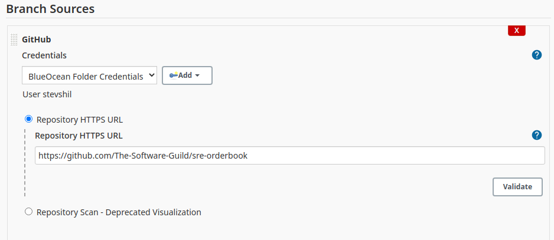
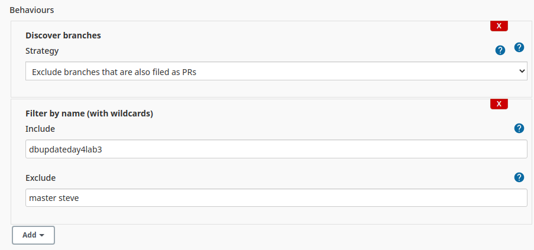
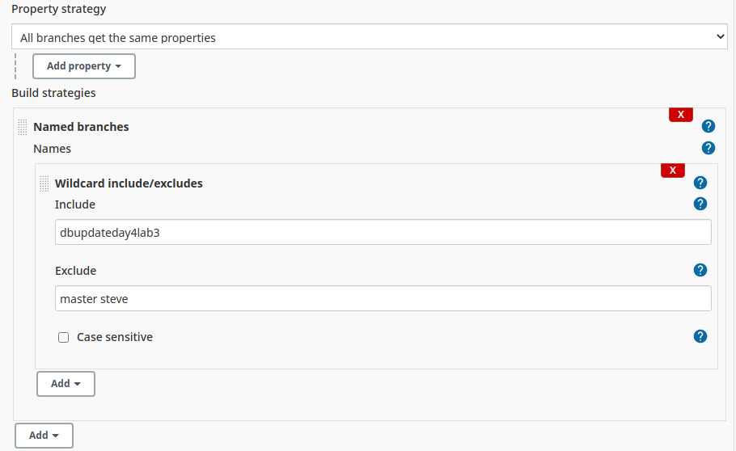
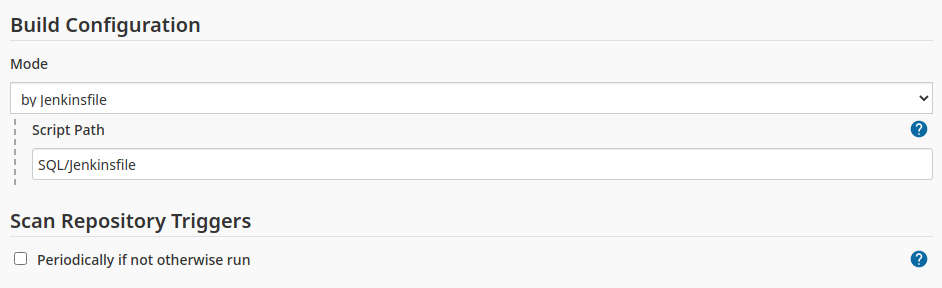
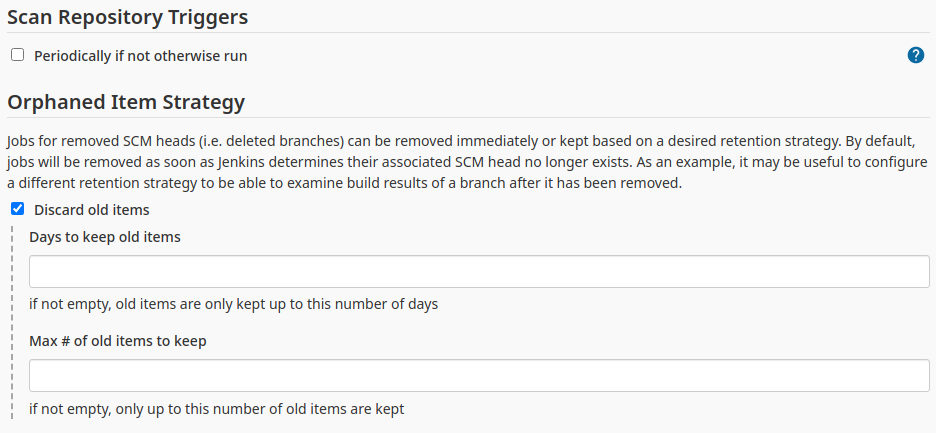
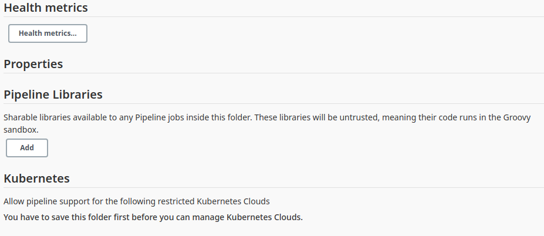
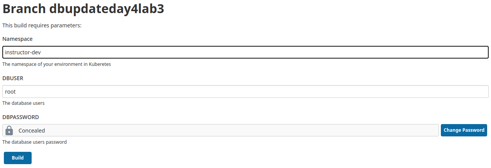

# Day 4 Lab 3

To use this branch students should follow this set up.  These instructions should be added to the course documentation so that they don't need to come to here.

## Setting up Jenkins

The only requirement is that the students add this repository and the dbupdateday4lab3 branch to Jenkins.  Add the following steps to the exercise;

1. Log in to the Jenkins server  https://jenkins.computerlab.online
2. Click **New Item**
3. Enter an item name of **team??**-appupdate
   Where ?? is your team number
4. At the bottom of the screen in the **Copy from** type **sre-orderbook**, this will give us the relevant credentials for the repository without having to do a complete Blue Ocean set up.
5. In **Branch Sources** set the repository to https://github.com/The-Software-Guild/sre-orderbook as per 
6. The **Behaviours** section should have;
   * **Discover branches**
     - Strategy: Exclude branches that are also filed as PRs
   * **Filter by name (with wildcards)**
     - Include: dbupdateday4lab3
     - Exclude: master steve
7. The **Property Strategy** should have;
   * All branches get the same properties
8. **Build strategies**
   * Named branches
      * Names
         * **Wildcard include/excludes**
           - Include: dbupdateday4lab3
           - Exclude: master steve
9. **Build Configuration**
   * Mode: by Jenkinsfile
     - Script Path: SQL/Jenkinsfile
10. **Orphaned Item Strategy**
    * Discard old items: ticked
11. Click **Save**

Screen shots of the above areas;

## Completing the setup

Once you click save the job will attempt to run.

It will fail since it requires parameters to run.

### To run

1. Click the name **dbupdateday4lab3**
2. In the left menu click **Build with Parameters**
3. You will need to add the namespace of your Kubernetes application to target, e.g. **team??dev** the username that is set for the database server, should be **root** and the password for the database user, if you've changed it, but default is secret123.

The screen will look as follows;

When ready click the **Build** button.

Then start to monitor your system to see what is happening.

As a hint every 2 minutes the system will fail to connect to the database as the password keeps switching from good to bad.
